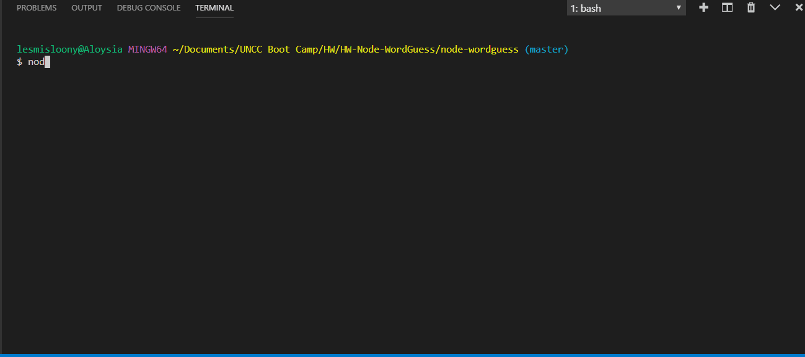

# Node Word Guess 

This is a hangman-style game which uses constructors and npm inquirer to run.  The files include:

* **Letter.js**: Contains a constructor, Letter, which is able to either display an underlying character or a blank placeholder depending on whether or not the user has guessed the letter. 

* **Word.js**: Contains a constructor, Word, that depends on the Letter constructor. This is used to create an object representing the current word the user is attempting to guess. 

* **index.js**: The file containing the logic for the course of the game

* **wordbank.txt**: This file can easily be changed without interfering with the javascript that runs the game.  Words should be separated by a comma and a space.  They are not case sensitive as the game will convert all of them to capital letters.  This file should be stored in the same location as `letter.js`, `word.js`, and `index.js`.